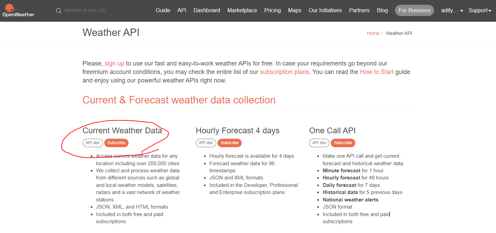

# Project 3 🎤🎶🎧

Welcome to CODEversity Project 3. This project will take about 2 weeks and will be due by the time we have the project showcase!

### Recap of the project so far

In Project 0 ([template](https://replit.com/@adityavarshney1/CODEversity-Spotify-P0)), we started with a simple app built with Flask. When we ran our app, a page opened up containing a header with the text "Hello world". Our website was born. From here we messed around a bit with the HTML and CSS to style it to our taste.

From there, in Project 1 ([template](https://replit.com/@adityavarshney1/CODEversity-Spotify-P1)), added new HTML and CSS files, images, links, styling, and text about our favorite music choices.

Most recently, in Project 2 ([template](https://replit.com/@adityavarshney1/CODEversity-Spotify-P2)) we took our musical choices to the next level by using python and flask's Jinja templating to make a templated list of concerts and showtimes and a time-based dark mode too.

### What's missing? 

At the moment, we don't have a way of bringing in real data to our web page. For example we might be interested in: 
* Tracking artists performing near the user's location
* Finding songs the user has listened to or likes on Spotify
* Queueing songs on Spotify or other web player
* Theming the mood of recommendations to match the weather outside
* And so much more...

These tasks involve learning more about our users and the real information out there. Since we don't have this information accessible to us directly, we need APIs to be able to access it.

## Goals for Project 3

In this part of the project, we'll be using APIs to request real data from online services. Using python on our server to extract data and templating to place data on our HTML pages, we'll be able to add real-world information to our beautiful webpages automatically!

## Spotify API

### 🎧 Why Spotify? 🎧 

Spotify is an online music service that connects audiences looking for specific music, podcasts, and music recommendations with artists and other audio content creators. 

Since our page is about music tastes and we know Spotify has some interesting recommendations and playlist information, adding Spotify data to our pages extends our websites to show off some real data.  

Lastly, since we are learning about Python in this course, we want to use Python be able to interact with outside data. Spotify is a great choice because there are several python **Spotify client** libraries that nicely wrap up the Spotify API into python functions. 

### 💻  What is the Spotify API? 💻 

Spotify offers third-party developers like us an **Application Programming Interface (API)** that we can use to interact with their data. 

The API is made up of several **endpoints**. Endpoints are ways developers can reach Spotify servers to ask for information. The different endpoints we can access are available in the [developer documentation](https://developer.spotify.com/documentation/web-api/reference/#/). 

#### Which API endpoints will we be using?

The Spotify API has developer documentation that goes over the two features we'll be talking to: 
- The playlists API lets us see a user's public playlists: [/users/{user_id}/playlists](https://developer.spotify.com/documentation/web-api/reference/#/operations/get-list-users-playlists)
- The recommendations API lets us create recommendations based on songs, albums, and genres: [/recommendations](https://developer.spotify.com/documentation/web-api/reference/#/operations/get-recommendations)

#### How do we access an API endpoint? 

We can access endpoints using HTTP requests. When we make a request, we get back a response from the endpoint. That response will usually contain the data we want.

## 🌐  API Requests (Primer) 🌐 

#### 📢 Requests 📢

APIs are typically accessible via **HTTP requests**. HTTP requests are packets of data sent to endpoint servers. Requests come in 5 varieties, but you will most commonly use _GET_ and _POST_ requests in projects where you interact with third party data. 

*Note: HTTPS has the same underlying protocol as HTTP but with encryption.*

**GET requests** "get" information from external servers. These requests happen all the time! We use them to browse webpages. 

Any time you go to YouTube, Google, Facebook, or Stack Overflow, your browser uses GET requests to "get" data from those sites behind the scenes. 

**POST requests** send information to external servers. Think of this like telling the endpoint some information that it will then save and maybe use later on. 

For example, if I change my name on Spotify, I would need to send data (my new name) to Spotify in a POST request. 

Spotify's servers will receive my request, _parse_ it (i.e. read it) and figure out I am issuing a change in information. The server(s) will then change my name in their system to the new name I gave. 

Finally, the server(s) will let me know (via a _response_) that the change was successfully made.

#### 👂 Responses 👂

After a request is made, external servers send back a **response**. Responses are packets of data that contain information. This information can be HTML sent back by the server or other information relevant to your request provided by the server or other error information. 

When we use our browsers to surf (make requests), the responses we typically care about are the ones that trigger a popup or some visual event. For example, a page loads or a notification dings. 

> When we use python to make requests, we get back the entire response packet in an object. We can save that information in a variable and extract certain parts to use in our own applications.

Since the internet is a wild and crazy place, errors are pretty common. So don't worry if you get a response that gives an error! Make sure to read the error information to figure out what's going on. Learn more about common error codes [here](https://moz.com/learn/seo/http-status-codes).

To see how a Spotify response looks in our whole system, download and view [this diagram](https://replit.com/@adityavarshney1/CODEversity-Spotify-P3#spotify-response.png).

## Getting Started 

### `spotipy` API client

If you went through the section above, you probably see why making requests can be confusing for beginners. Lucky for us, the `spotipy` API client can help us make requests.

Python has a [Spotify-specific library called `spotipy`](https://spotipy.readthedocs.io/en/2.19.0/) that will help us ask Spotify for data. It has some functions that we can use to gather user playlist and recommendation data:
- [user_playlists](https://spotipy.readthedocs.io/en/2.19.0/?highlight=user_playlists#spotipy.client.Spotify.user_playlists)
- [recommendations](https://spotipy.readthedocs.io/en/2.19.0/?highlight=user_playlists#spotipy.client.Spotify.recommendations)

**Read into those functions before proceeding.** 
**Then, take this quiz: https://forms.gle/SNCECG11UNH8oJd18***

### Setting up Spotify Developer Account

For this next part, we'll need to become developers registered with Spotify. To do this, we'll create a developer account [here](https://developer.spotify.com/dashboard/). 

Once you are finished registering, you should be at a dashboard page. Click on the green "Create an App" button. Put anything you like in the App Name and description. 


### Setting up Spotify API secrets

**Secrets** are values that are unique to our application and account. They define how Spotify authenticates us and, more importantly, bills us. To avoid leaving secrets lying around your code, place them in environment variables.

**Important**: Secrets are how the API authenticates its users. If your credentials are left unprotected, they could get used without you knowing. This can lead to unexpected fees or your account getting unexpectedly banned.

In the left sidebar menu in Repl, click on the lock icon:


#### Adding secrets to the environment

In the key, add the key `CLIENT_ID`. As the value, use the `CLIENT_ID` value you see in the Spotify Developer console.

Do the same for `CLIENT_SECRET`. In the key, add the key `CLIENT_SECRET`. As the value, use the `CLIENT_SECRET` value found in the dev console.

Find your Spotify user ID. Go [here](https://www.spotify.com/us/account/overview/?utm_source=spotify&utm_medium=menu&utm_campaign=your_account)and copy the username value into an environment variable with the key `USERNAME`.

#### Using secrets defined in our environment

In our python file, we can use the values of these environment variables using the following style: 
```python
import os 
CLIENT_ID = os.environ["CLIENT_ID"]
CLIENT_SECRET = os.environ["CLIENT_SECRET"]
USERNAME = os.environ["USERNAME"]
```
This part is done for you in `main.py`! 

## Recommendations

Let's now use `spotipy` to get recommendations from Spotify. Spotify is an excellent source of song recommendations, and we can use it to suggest new songs based on the **songs, artists, and genres** we like.

To get public playlists, we'll use the spotipy client's [recommendations](https://spotipy.readthedocs.io/en/2.19.0/?highlight=user_playlists#spotipy.client.Spotify.recommendations) function. This function makes a GET request to Spotify's [/recommendations](https://developer.spotify.com/documentation/web-api/reference/#/operations/get-recommendations) endpoint. 

Like before, if spotipy is successful, the API will respond with recommendation data. `sp.recommendations` does the work for us in parsing that response into a python dictionary that we can use.

___
### Objectives
___
1. In `main.py` fill out the `get_recommendations` function.

- Create an array called `recommendation_data` that will keep track of all the recommendations Spotify provides us.
- Get Spotify data using `sp.recommendations(...)`. Save the output to a variable like `response`.
  - This function takes in **seed data** required to generate recommendations. We pass `seed_artists`, `seed_tracks` and `seed_genres` to the function. Each of these is a python list of strings.
  - Spotify needs at least one of those to generate seeds so we need to check that the `seed_...` arrays passed into our `get_recommendations` function are not empty. **Write an if statement where the conditional checks that at least one of the arrays (seed_artists, seed_tracks, seed_genres) is not empty.**
- Print `response` and see what it looks like. Results should come in a python dictionary. The dictionary has a key called `"tracks"` that has a list of dictionaries each containing song recommendation information. 
- **Once you are able to get recommendation output**, loop through the recommendation dictionaries in `response['tracks']`
- For each dictionary with recommendation data, **decide** what information you need to display to the user? For now, let's at least present our user with the name of the recommended song, any album cover art for that track, artist information for that track, and a link to the song on Spotify.
  - For example, if my loop is `for i in response['track']`, I can get the name of a recommended song using `i['name']`. Use a similar strategy to extract other interesting recommendation data.
  - To get all the artists on a track, create a string called `artistNames` and loop through each of the artists in `i['artists']`. For each `artist` in `i['artists']`, add the name to the ongoing list using `artistNames += artist['name']`
- Bundle up the different interesting items into a new collection (list or dictionary).
  - For example, I could use `bundled_data = [name, artists, image, link]` to create a list with the data I want to send the user for a particular recommendation. Extract more items to add to this bundle if you want to show your user other cool recommendation info.
- Use `.append(...)` to add your bundled data into the `recommendation_data` array.
- After the loop is finished, return `recommendation_data` which now contains data you want to present your users
___
2. In `main.py` update our flask endpoint to show the newly extracted playlist data.
- Under `@app.route("/recommendations")`, add a new placeholder variable `recommendations` to the `render_template` function and set it equal to the output of the `get_recommendations` function
___
3. In your `recommendations.html` file, update the HTML with Jinja template.
- **Remember** we want to use templating to display playlist info on the page without manually copy-pasting all the data ourselves.
- Loop through the `recommendations` placeholder using a Jinja for-loop. Remember that Jinja for-loops need to index through array elements via a counter.
  - `{% for i in range(recommendations | length) }`
- For each bundle of recommendation data `recommendations[i]`, create a new list item that presents this information to the user. Fit this information into your HTML/CSS layout.
  - If you set `bundled_data = (name, artists, image, link)` in `get_recommendations` then `recommendations[i][0]` would get you the name of the public playlist.
  - Add the different items in your bundle to your list item HTML layout.

## Weather API

### Motivation

So far in our project, we have been building out music recommendations and features, and we've even gotten real music suggestions and playlist information using the Spotify API. 

However, it's a known fact that weather has an important role in the music we want to listen to on a given day. (OK, maybe not a fact, but just go with me here...)

Additionally, using weather data lets us change our pages spontaneously, giving users something to look forward to when they hit up our page.

... 🎶 	🎤 🎼	**x** 	🌤️ 🌞 🌦️ ...

And the **juiciest** reason behind this is to be able to update our song recommendations *based on* the weather reading we retrieve. This advanced feature will let us give some very interesting recommendations that combine the OpenWeather API with the Spotify API!

... 🎶 	🎤 🎼	**x** 	🌤️ 🌞 🌦️ ...

The vision here is to update our pages based on the weather at some location we choose. Think hometown, favorite musician's hometown, favorite city, place with the wildest weather, or any (random) place on the planet. Any place with a latitude and longitude tracked by the OpenWeather API is fair game.

Once we've picked a place, we'll need to look up its coordinates. For example, if I wanted the latitude and longitude of Detroit, I can find them by searching [online](https://www.google.com/search?q=latitude+longitude+detroit&rlz=1C1CHBF_enUS897US897&oq=latitude+longitude+detroit&aqs=chrome..69i57j0i22i30l2j0i390l5.3495j0j7&sourceid=chrome&ie=UTF-8).


```js
Latitude: 42.348495
Longitude: -83.060303
```

### Getting started
The OpenWeather API provides us with ways to get free weather information via an API. Sign up [here](https://home.openweathermap.org/). 

Register for an account. Mark the account as being for educational purposes. On the API page, under `Current & Forecast weather data collection` > `Current Weather Data`, hit the Subscribe button to get access to the API. 



The OpenWeather API lets us track the weather at our location. We can use their open API to tell us what kind of weather it is at a given location. Once we know the weather, we can customize our page based on the weather at the user's location!

#### OpenWeather API Key

To view your API key, click your username in the top right of the nav bar and select "My API Keys" from the dropdown menu.


This will lead you to a page that shows your active API keys. Copy the key and switch over to the Replit editor.

Save your API Key in your Replit project secrets [(done in  the section about setting up Spotify API Secrets.)](#setting-up-spotify-api-secrets) This time we want to save our OpenWeather API Key under the name `OPEN_WEATHER_API_KEY`. Remember that leaving API keys exposed makes it possible for others to use your account without your knowledge and potentially rack up fees! Be careful.

### Using the OpenWeather API

We will use the same idea of HTTP Requests and Responses described above to interact with certain API endpoints OpenWeather has set up. 

Take a look at the endpoint here: https://openweathermap.org/current 
```http
https://api.openweathermap.org/data/2.5/weather?lat={lat}&lon={lon}&appid={API key}
```
**Once you reach this point, take this quiz! https://forms.gle/55hDCzx2r5GNjhRv7**

#### Making a request

With the Spotify API, we had a helpful `spotipy` client to handle interacting with the API. Using this python library, we could make API requests in plain python code without worrying about the HTTP part of our requests.

With the OpenWeather API, we'll need to use a different library called `requests` that lets us make HTTP requests to servers and `GET` or `POST` data. 

Typically, `requests` code will be like the following: 
```python
import requests 

response = requests.get(YOUR_URL_HERE, params=PARAMETERS_DICTIONARY)
```
* the URL that gets passed in is the URL of the endpoint you'd like to reach
* the params that get passed in come in the format of a dictionary. To pass in my API key, I just have to pass in `params={'appid': "MY_API_KEY"}` to the `requests.get` function. To add other parameters into my request (`lat`, `lon`), I just add the keys and values to my dictionary. 

**Example**
```python
# location: detroit 
response = requests.get("https://api.openweathermap.org/data/2.5/weather", params={"lat": 42.348495, "lon": -83.060303, "appid": "sikeyouthoughtI'dexposemykeyhaha"})
```

After we make this request, we should get a response like the following: 

### Objectives

1) Create a function called `get_weather_data` that takes in a latitude value and longitude value as parameters. In the function, make a request to the OpenWeather API /weather endpoint, passing in these values. Return the OpenWeather API response.
2) Create another function that does something fun with the weather data you get back. Some ideas:
- create a function called `update_background_using_weather` that takes in weather data response as a parameter, finds the relevant weather information, and then adds a particular background image (can be a gif) to the page or to a specific section of the page depending on the current weather.
  - For example, use [this image](https://gray-wtoc-prod.cdn.arcpublishing.com/resizer/oY8_w99tVZ07cjy3Lc8zEtA3ggQ=/1200x675/smart/filters:quality(85)/cloudfront-us-east-1.images.arcpublishing.com/gray/FS6JYB7I2NAZFN634MYHMDK7QQ.gif) if the weather comes back as rainy.
  - If you roll with this option, remember you can change the opacity of your div. [This post](https://stackoverflow.com/questions/39579666/how-to-set-background-image-on-flask-templates) may also be helpful for getting your images using flask's `url` function.
- create a function called `create_weather_section`  that takes in weather data response as a parameter, finds the relevant weather information, and returns a `weather_update` string that can be used in a `marquee` field underneath the header or above the footer of your website.
3) In `main.py` under the function routing to the `/recommendations` page, call the functions you just created and pass their return values as placeholders in `render_template`.
4) In `recommendations.html`, update your template to include new sections that use this new weather-based information.


  ### 🎤🎶🎧	 **x** 	🌤️🌞🌦️

  Still haven't had enough?

  Let's get to the juicy part of this project. We made a function that can query the OpenWeather API (`get_weather_data`). Now let's take the weather information we get back and use it to update the recommendations we generate on our recommendations page.

  Write a function called `update_recommendations_using_weather` that reads weather data, finds the relevant weather information, and then uses the weather response to generate recommended songs.

  For example, sticking to the theme of rain, I remember listening to Maroon 5's "She Will Be Loved" and Adele's "Hello" on rainy days past. Based on this idea, we could come up with a mapping from weather type to recommendation inputs.

```
weather_to_recommendations = {
  <weather API sunny string>: [<inputs to generate sunny-day music on spotify>],
  <weather API cloudy string>: [<inputs to generate cloudy-day music on spotify>],
  ...
}
```

  `update_recommendations_using_weather` creates this dictionary and then calls `get_recommendations` with the inputs that the current weather maps to.

```
recommendations_based_on_weather = get_recommendations(weather_to_recommendations[<weather>])
```

Test this out by supporting a few different weather types. You can find the full list of weather types here: https://openweathermap.org/weather-conditions

Lastly, now that we have this data we need to use it on our page. You can be the judge on how you'd like this done. A couple ideas:
- build a new weather-themed HTML page on your site that is specifically for weather-based recommendations (...for cool kids only)
- change the logic under /recommendations to use the `update_recommendations_using_weather` code instead of plain old `get_recommendations`

## Final Result!

If you've gotten this far, you... should take a walk outside :') just kidding! Great work!! If you didn't make it to the end or finished it after the course ended, no problem & good on you for getting through the course and maybe even this massive project!

Throughout this 8-week project we set out to: 
- learn about building functional HTML pages
- learn about full-stack web development using Flask
- learn about building useful Python code
- learn about APIs and requesting data from third-party services
- learn how we can integrate multiple APIs together into an awesome service

Along the way we: 
- sharpened our HTML, CSS, and Python skills
- learned about a lot of what it's like to be a software engineer today
- built a cool, custom webpage that we can show off to friends, family, and future employers
- discussed key topics that will continuously pop up if you decide to continue studying technology and its applications

With that, congratulations on reaching this point! Please let us know your thoughts on this project using this form: https://forms.gle/FUAuZVXUw1NBBxiX6 

# Extras

Warning: Only for those who want **MORE**!

## Playlists

Let's use `spotipy` to query the Spotify API and get back information about your **public playlists**. Public playlists are playlists you own and have shared to your Spotify profile.

To get public playlists, we'll use the spotipy client's [user_playlists](https://spotipy.readthedocs.io/en/2.19.0/?highlight=user_playlists#spotipy.client.Spotify.user_playlists) function. Remember that this function makes a GET request to Spotify's [/users/{user_id}/playlists](https://developer.spotify.com/documentation/web-api/reference/#/operations/get-list-users-playlists) endpoint. 

If spotipy is successful, the API will respond with playlist data. `sp.user_playlists` does the work for us in parsing that response into a python dictionary that we can use.
___
### Objectives
___
1. In `main.py` fill out the `get_playlists` function.

- Create an array called `playlist_data` that will keep track of all the playlists found for your user.
- Get Spotify data using `sp.user_playlists(...)`. Make sure to pass in the necessary `spotify_user_id` string. Save the output to a variable like `response`.
- **First** print the output and see what it looks like. You'll see that the results come in a python dictionary. The dictionary has a key called `"items"` that has a list of dictionaries each containing playlist information. 
- **Then** loop through the playlist dictionaries in `response['items']`
- For each dictionary with playlist data, **decide** what information you need to display to the user? For now, let's at least present our user with the name of the playlist, the playlist image, and the playlist description.
  - For example, if my loop is `for i in response['items']`, I can get the name of a playlist using `i['name']`. Use a similar strategy to extract other interesting playlist data.
- Bundle up the different interesting items into a new collection (list or dictionary)
  - For example, I could use `bundled_data = [name, image, description]` to create a list with the data I want to send the user for a particular playlist.
- Use `.append(...)` to add your bundled data into the `playlist_data` array.
- After the loop is finished, return `playlist_data` which now contains data you want to present your users
___
2. In `main.py` update our flask endpoint to show the newly extracted playlist data.
- Under `@app.route("/playlists")`, add a new placeholder variable `playlists` to the `render_template` function and set it equal to the output of the `get_playlists` function.
  - Call `get_playlists` and pass in your own spotify username (saved in `USERNAME`)
___
3. In your `playlists.html` file, update the HTML with Jinja template. 
- **Remember** we want to use templating to display playlist info on the page without manually copy-pasting all the data ourselves.
- Loop through the `playlists` placeholder using a Jinja for-loop. Remember that Jinja for-loops need to index through array elements via a counter.
  - `{% for i in range(playlists | length) }`
  - If you're stuck on this part, please revisit the [Project 2 README's](https://replit.com/@adityavarshney1/CODEversity-Spotify-P2?v=1#README.md) section on Jinja templating.
- For each bundle of playlist data `playlists[i]`, create a new list item that presents this information to the user. Fit this information into your HTML/CSS layout.
  - If you set `bundled_data = (name, image, description)` in `get_playlists` then `playlists[i][0]` would get you the name of the public playlist.
  - Add the different items in your bundle to your list item HTML layout.